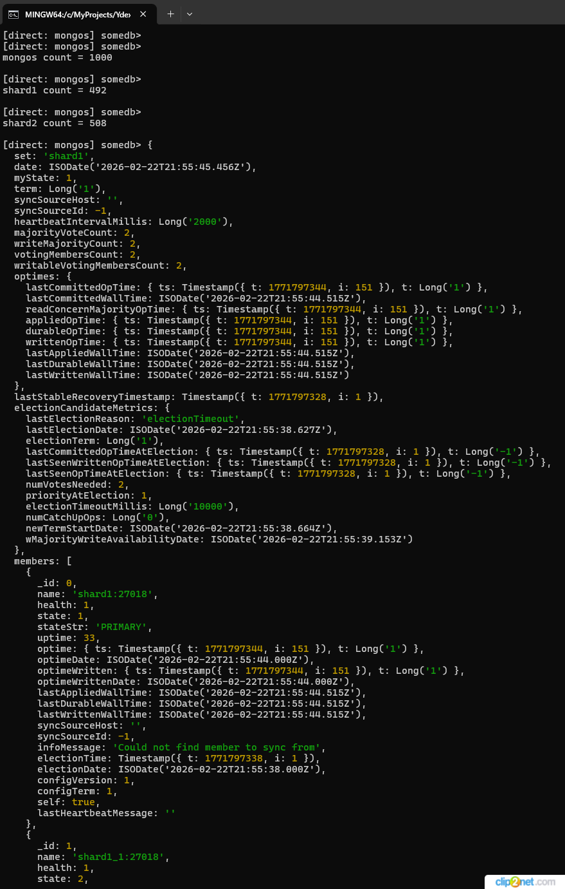

## Как запустить и проверить

Запустите <b>bash init.sh</b> в каталоге sharding-repl-cache/scripts. В результате будут развернуты контейнеры и выполнена инициализация MongoDb.
 Информация по кол-ву документов в шардах и детальная информация по каждому шарду включая реплики будет выведена в консоли.

## Доступные эндпоинты

Список доступных эндпоинтов, swagger http://localhost:8080/docs